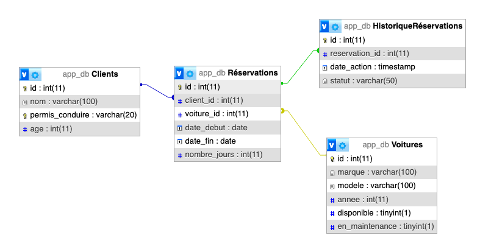

# EVAL 2 - Les triggers SQL
[]()

## Contexte
Vous travaillez pour une entreprise qui gère un système de location de voitures en ligne. Vous êtes chargé d'implémenter
des triggers pour automatiser certaines opérations critiques liées aux réservations et à la gestion du stock de véhicules.

### Schéma de la BDD de l'application



## Installation

Un fichier `docker-compose.yaml` est fourni, ainsi il suffit de démarrer les services.
Ce dernier importe automatiquement la base de données
- `docker compose up -d`

Vous pouvez ensuite accéder à PHPMyAdmin, à l'adresse suivante :
- [http://localhost:8081](https://localhost:8081)

## Missions

Dans cette partie, vous devez concevoir et implémenter plusieurs triggers pour automatiser les règles métier et assurer
l'intégrité des données dans votre base de données. 


### Triggers a implémenter:

- Trigger de Mise à Jour de la Disponibilité des Voitures lors d'une Réservation
- Trigger de Vérification de l'Âge du Client avant une Réservation
- Trigger de Vérification de la Validité du Permis de Conduire avant la création d'un nouveau client
- Trigger de Vérification de la Disponibilité de la Voiture avant une Réservation
- Trigger pour Éviter les Chevauchements de Réservations sur la Même Voiture

## Modalités de rendu
Dans une volonté de création d'une documentation future, créer un fichier `triggers-nom-prenom.md`dans lequel vous allez détailler
chaque trigger. 
Chaque trigger devra être accompagné d'une explication détaillée de son rôle, de son fonctionnement et du code SQL correspondant.

## Exemple de rendu

### 1. Trigger de Mise à Jour de la Disponibilité des Voitures lors d'une Réservation

- **Nom du Trigger** : `Nom_du_trigger`
- **Événement** : `AFTER INSERT` sur la table `nom_table`
- **Objectif** :
    - Indiquer les actions que doit effectuer le trigger

#### Code SQL :

```sql
CODE SQL DU TRIGGER

```


